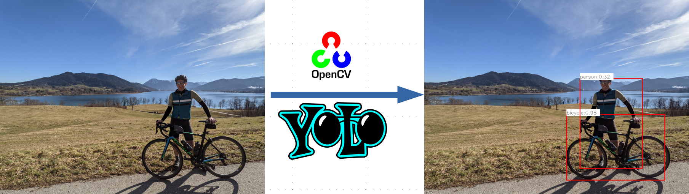

# CPPND: Capstone - Object dectection with Yolo and openCV

## Description

This project can detect objects in pictures. The implementation is using [OpenCV](https://github.com/opencv/opencv) and [yolov3-tiny](https://pjreddie.com/darknet/yolo/).
The programm opens a file an perform the object detection. As a result a frame is drawn around the object and also the name and confidence level is shown. The program can be used with command line




## Dependencies for Running Locally
* cmake >= 3.7
  * All OSes: [click here for installation instructions](https://cmake.org/install/)
* make >= 4.1 (Linux, Mac), 3.81 (Windows)
  * Linux: make is installed by default on most Linux distros
  * Mac: [install Xcode command line tools to get make](https://developer.apple.com/xcode/features/)
  * Windows: [Click here for installation instructions](http://gnuwin32.sourceforge.net/packages/make.htm)
* gcc/g++ >= 5.4
  * Linux: gcc / g++ is installed by default on most Linux distros
  * Mac: same deal as make - [install Xcode command line tools](https://developer.apple.com/xcode/features/)
  * Windows: recommend using [MinGW](http://www.mingw.org/)
* OpenCV >= 4.1.0
  * Linux [Click here for installation instructions](https://linuxize.com/post/how-to-install-opencv-on-ubuntu-18-04/)  (Installing OpenCV from source)

##  Build Instructions

1. Clone this repo from 

  https://github.com/Marios007/Capstone-Project

2. Make a build directory in the top level directory: 

```
mkdir build && cd build
```

3. Compile: 
```
cmake .. && make
```


## File Structure

`files/` contains sample images, which can be used to test the program

`model/` includes the yolov3-tiny files 
(can also be downloaded from: 
- https://pjreddie.com/media/files/yolov3-tiny.weights 
- https://github.com/pjreddie/darknet/blob/master/cfg/yolov3-tiny.cfg
- https://github.com/pjreddie/darknet/blob/master/data/coco.names
)

`src/` includes all the code including headers

## How to run

After compiling with make the executable wuth the name `openCVdetector` is stored in the `build/` folder 

```
./openCVdetector [options] --image=<full image path>
```

### Options

`-c` : (Optional) confidence threshold between 0.0 and 1.0 as a double.

`-n` : (Optional) Non-maximum Suppression (see: https://towardsdatascience.com/non-maximum-suppression-nms-93ce178e177c)

### Example

Run it example: 
```
./openCVdetector -c=.2 -n=0.5 -i=/home/workspace/Code/Capstone/CapstoneProject/files/a.jpg
```
Press any key to close the picture. The output picture is stored in the root folder of the project.

## RUBRIC POINTS


### YES: README (All Rubric Points REQUIRED)
* **YES:** The README is included with the project and has instructions for building/running the project.  If any additional libraries are needed to run the project, these are indicated with cross-platform installation instructions.  You can submit your writeup as markdown or pdf.
* **YES:** The README describes the project you have built.  The README also indicates the file and class structure, along with the expected behavior or output of the program.
* **YES:** The README indicates which rubric points are addressed. The README also indicates where in the code (i.e. files and line numbers) that the rubric points are addressed.


### YES: Compiling and Testing (All Rubric Points REQUIRED)
* **YES:** The project code must compile and run without errors. 
  * Used `make` and `cmake` with `cmake` settings defined in ./CMakeLists.txt.


### YES: Loops, Functions, I/O
* **YES:** A variety of control structures are used in the project.  The project code is clearly organized into functions.
  * Every *.cpp file
  
* **YES:** The project reads data from an external file or writes data to a file as part of the necessary operation of the program.
  * Reads image in main.cpp as frame

* **YES:** The project accepts input from a user as part of the necessary operation of the program.
  * Command line arguments are used in main.cpp

### Object Oriented Programming
* **YES:** The project code is organized into classes with class attributes to hold the data, and class methods to perform tasks.  
  * All *.cpp and *.h files

* **YES:** All class data members are explicitly specified as public, protected, or private.
  * All *.cpp and *.h files

* **YES:** All class members that are set to argument values are initialized through member initialization lists.
  * All *.cpp and *.h files

* **YES:** All class member functions document their effects, either through function names, comments, or formal documentation. Member functions do not change program state in undocumented ways.
  * All *.cpp and *.h files

* **YES:** Appropriate data and functions are grouped into classes. Member data that is subject to an invariant is hidden from the user. State is accessed via member functions.
  * All *.cpp and *.h files

* **NO:** Inheritance hierarchies are logical. Composition is used instead of inheritance when appropriate. Abstract classes are composed of pure virtual functions. Override functions are specified.

* **NO:** One function is overloaded with different signatures for the same function name.

* **NO:** One member function in an inherited class overrides a virtual base class member function.

* **YES:** One function is declared with a template that allows it to accept a generic parameter.
  * In buffer.h

### Memory Management
* **YES:** At least two variables are defined as references, or two functions use pass-by-reference in the project code.
  * In detector.h

* **YES:** At least one class that uses unmanaged dynamically allocated memory, along with any class that otherwise needs to modify state upon the termination of an object, uses a destructor.
  * in fileinput.h

* **NO*:** The project follows the Resource Acquisition Is Initialization pattern where appropriate, by allocating objects at compile-time, initializing objects when they are declared, and utilizing scope to ensure their automatic destruction.
 
* **YES:** For all classes, if any one of the copy constructor, copy assignment operator, move constructor, move assignment operator, and destructor are defined, then all of these functions are defined.
  * in detector.h

* **YES:** For classes with move constructors, the project returns objects of that class by value, and relies on the move constructor, instead of copying the object.
  * in detector.cpp

* **YES:** The project uses at least one smart pointer: unique_ptr, shared_ptr, or weak_ptr. The project does not use raw pointers.
  * in main.cpp

### Concurrency
* **NO:** The project uses multiple threads in the execution.

* **NO:** A promise and future is used to pass data from a worker thread to a parent thread in the project code.

* **Yes:** A mutex or lock (e.g. std::lock_guard or `std::unique_lock) is used to protect data that is shared across multiple threads in the project code.
  * in buffer.h
  
* **NO:** A std::condition_variable is used in the project code to synchronize thread execution.
